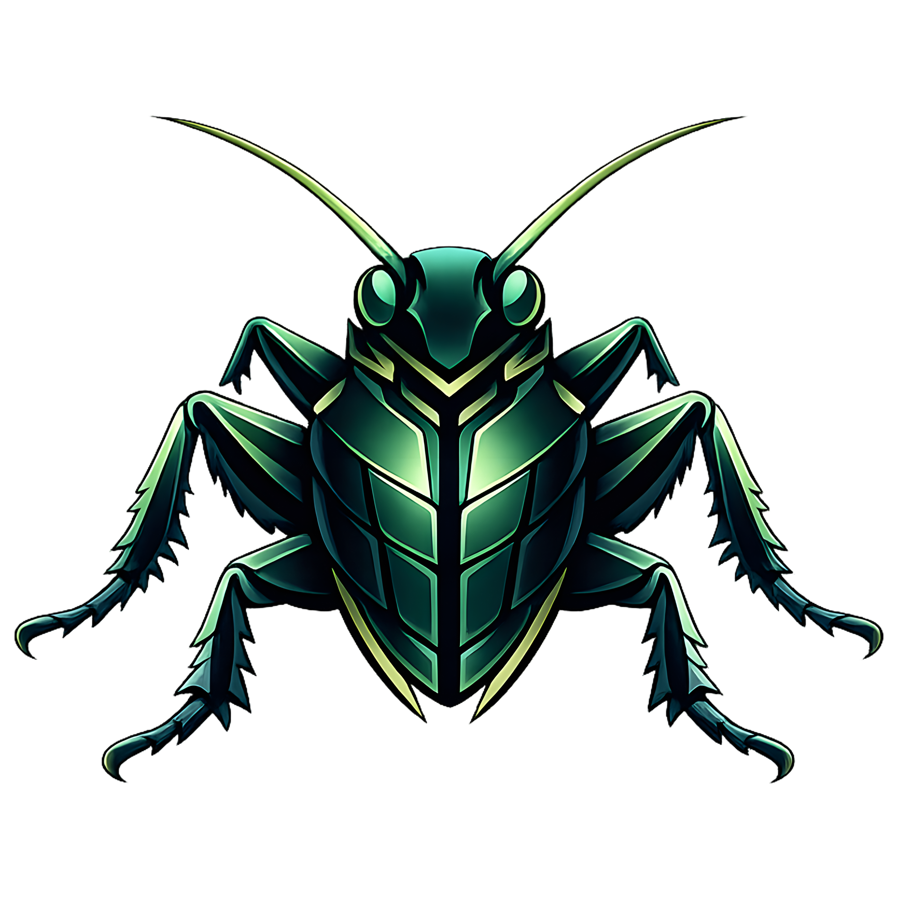

<div align="center">



<br>

<picture>
  <source media="(prefers-color-scheme: dark)" srcset="assets/hero_banner.svg">
  <source media="(prefers-color-scheme: light)" srcset="assets/hero_banner.svg">
  
</picture>

<br>

[](https://github.com/BEKO2210/cricket-brain/actions/workflows/ci.yml)
[](LICENSE)
[](COMMERCIAL.md)
[](https://crates.io/crates/cricket-brain)
[](https://docs.rs/cricket-brain)
[](#-embedded--no_std)
[](https://www.rust-lang.org)
[](#-quality)

**Adaptive neuromorphic signal processing. Sub-kilobyte memory. 97 ns/step.**

*Hardwired core + adaptive plasticity. Inspired by 200 million years of cricket evolution.*

[Quick Start](#-quick-start) | [Benchmarks](#-benchmarks) | [Science](#-scientific-validation) | [Docs](https://docs.rs/cricket-brain) | [Deutsch](#-auf-deutsch)

</div>

---

## What is CricketBrain?

CricketBrain is a **neuromorphic signal processor** that recognizes temporal patterns in real-time using delay-line coincidence detection — the same mechanism the field cricket (*Gryllus bimaculatus*) uses to find mates in noisy environments.

> **Hardwired core architecture with optional adaptive plasticity.**
> 5 neurons, 6 synapses, STDP learning, homeostatic regulation — **97 ns/step** in **~1 KB RAM**.

<p align="center">
  <picture>
    <source media="(prefers-color-scheme: dark)" srcset="assets/circuit_inline.svg">
    <source media="(prefers-color-scheme: light)" srcset="assets/circuit_inline.svg">
    
  </picture>
</p>

### Why Should You Care?

<table>
<tr><th></th><th>CricketBrain</th><th>Traditional ML</th><th>Deep Learning</th></tr>
<tr><td><b>Latency</b></td><td align="center"><code>97 ns</code></td><td align="center"><code>~100 us</code></td><td align="center"><code>~10 ms</code></td></tr>
<tr><td><b>Memory</b></td><td align="center"><code>~1 KB</code></td><td align="center"><code>10+ KB</code></td><td align="center"><code>100+ MB</code></td></tr>
<tr><td><b>Training</b></td><td align="center"><code>Optional STDP</code></td><td align="center"><code>Hours</code></td><td align="center"><code>Days-Weeks</code></td></tr>
<tr><td><b>GPU</b></td><td align="center">No</td><td align="center">No</td><td align="center">Yes</td></tr>
<tr><td><b>Deterministic</b></td><td align="center">Yes</td><td align="center">Depends</td><td align="center">No</td></tr>
<tr><td><b>no_std / Embedded</b></td><td align="center">Yes</td><td align="center">Rare</td><td align="center">No</td></tr>
<tr><td><b>Explainable</b></td><td align="center">Fully</td><td align="center">Partially</td><td align="center">Black box</td></tr>
</table>

---

## Use Cases

| Domain | Application | How CricketBrain Helps |
|--------|-------------|------------------------|
| **Medical Research** | ECG rhythm analysis | Temporal pattern detection for rhythm classification research ([demo](examples/sentinel_ecg_monitor.rs)) |
| **Industrial IoT** | Vibration monitoring | Detect bearing failure patterns at the sensor node |
| **Audio** | Keyword / wake-word detection | Sub-millisecond response without cloud roundtrip |
| **Security** | Network traffic analysis | Temporal pattern anomaly detection at line rate |
| **Robotics** | Sensor fusion | Deterministic latency for real-time control loops |
| **Embedded** | Microcontroller signal processing | Runs on Arduino Uno (2 KB RAM) |

---

## Quick Start

### Install & Run (30 Seconds)

```bash
git clone https://github.com/BEKO2210/cricket-brain.git
cd cricket-brain
cargo run --example live_demo -- "HELLO WORLD"
```

```
--- Spike Train (each char = 10ms) ---
|||||_____|||||_____|||||_____|||||_______________|||||_______________...

Decoded output: "HELLO WORLD"
Match: EXACT MATCH
```

### Use as a Library

```toml
[dependencies]
cricket-brain = "3.0"
```

```rust
use cricket_brain::prelude::*;

fn main() -> Result<(), Box<dyn std::error::Error>> {
    let mut brain = CricketBrain::new(BrainConfig::default())?;

    // Feed a 4500 Hz signal — spikes appear
    for _ in 0..100 {
        let output = brain.step(4500.0);
        if output > 0.0 {
            println!("Spike! amplitude={output:.3}");
        }
    }

    // Silence — guaranteed zero false positives
    for _ in 0..50 {
        assert_eq!(brain.step(0.0), 0.0);
    }

    brain.reset();
    Ok(())
}
```

---

## Multi-Language Support

<table>
<tr>
<td>

**Rust** (native)
```rust
use cricket_brain::prelude::*;
let mut brain = CricketBrain::new(
    BrainConfig::default()
)?;
let out = brain.step(4500.0);
```

</td>
<td>

**C / C++ / Swift**
```c
BrainHandle *h = NULL;
brain_new(&h, 5, 4000.0, 5000.0);
float out;
brain_step(h, 4500.0, &out);
brain_free(h);
```

</td>
</tr>
<tr>
<td>

**Python**
```python
from cricket_brain import BrainConfig, Brain
brain = Brain(BrainConfig())
out = brain.step(4500.0)
batch = brain.step_batch([4500.0] * 100)
```

</td>
<td>

**JavaScript / TypeScript (WASM)**
```typescript
import { Brain } from "cricket-brain-wasm";
const brain = new Brain(42);
const out = brain.step(4500.0);
const events = brain.drainTelemetry();
```

</td>
</tr>
</table>

```bash
cargo build --release -p cricket-brain-ffi        # C FFI  →  crates/ffi/include/cricket_brain.h
cd crates/python && maturin develop --release      # Python →  pip install cricket-brain
cd crates/wasm && wasm-pack build --target web     # WASM   →  npm package
```

---

## Benchmarks

<table>
<tr><th>Scenario</th><th align="right">Latency</th><th align="right">Throughput</th><th align="right">Memory</th></tr>
<tr><td><b>Canonical 5-neuron</b></td><td align="right"><code>0.175 us/step</code></td><td align="right">5.7M steps/sec</td><td align="right">348 bytes</td></tr>
<tr><td><b>1,280-neuron predictor</b></td><td align="right">—</td><td align="right">50.1M neuron-ops/sec</td><td align="right">0.30 MB</td></tr>
<tr><td><b>40,960-neuron scale</b></td><td align="right">—</td><td align="right">40.7M neuron-ops/sec</td><td align="right">13.91 MB</td></tr>
<tr><td><b>Arduino no_std</b></td><td align="right">—</td><td align="right">—</td><td align="right"><code>944 bytes</code></td></tr>
</table>

### vs. Classical Baselines (SNR = 0 dB)

Tested against 3 classical detectors under **identical conditions** ([source](examples/baselines.rs)):

| Method | TPR | FPR | |
|--------|:---:|:---:|---|
| **CricketBrain** | **1.000** | **0.000** | Temporal coincidence rejects noise |
| IIR Bandpass | 1.000 | 0.558 | Cannot distinguish pattern from noise |
| Goertzel (FFT) | 0.017 | 0.000 | Misses jittered signals |
| Matched Filter | 0.000 | 0.000 | Needs high SNR (>10 dB) |

> CricketBrain achieves **perfect detection (TPR=1.0) with zero false positives (FPR=0.0)** across all SNR levels from -10 dB to +30 dB.

---

## Features

### Core

- **Gaussian resonators** — frequency-selective neurons with adaptive bandwidth
- **Delay-line synapses** — ring-buffer propagation delays (1-9 ms)
- **Coincidence detection** — fires only on sustained temporal evidence
- **Adaptive sensitivity (AGC)** — automatic gain control
- **Synaptic plasticity (STDP)** — online weight adaptation via spike-timing
- **Homeostatic thresholds** — automatic target activity maintenance
- **Sequence prediction** — N-gram pattern matching with confidence scoring
- **Multi-token detection** — parallel resonator banks (one circuit per token)

### Production

| Feature | Description |
|---------|-------------|
| **Privacy Mode** | Timestamp anonymization + value coarsening (designed for privacy-sensitive contexts) |
| **Snapshot/Restore** | Serialize full state with CRC64 checksums |
| **Telemetry** | Structured event hooks + JSON Lines sink |
| **Chaos Detection** | Shannon entropy monitoring with overload alerts |
| **Deterministic** | Seeded RNG — bitwise identical results across platforms |
| **Error Codes** | Consistent FFI contract across Rust/C/Python/WASM |

### Feature Flags

```toml
cricket-brain = { version = "1.0", features = ["serde", "parallel"] }
```

| Flag | Default | Description |
|------|:-------:|-------------|
| `std` | Yes | Standard library support |
| `no_std` | — | Embedded mode (alloc only) |
| `serde` | — | Snapshot serialization with CRC64 |
| `parallel` | — | Rayon-based resonator bank parallelism |
| `telemetry` | — | Structured event hooks |
| `cli` | — | JSON telemetry sink + config parsing |

---

## Embedded / `no_std`

The core crate is fully `no_std` compatible with `#![deny(unsafe_code)]`.

```bash
cargo build -p cricket-brain-core --no-default-features
```

**Minimal embedded example** ([`examples/arduino_minimal.rs`](examples/arduino_minimal.rs)):
- Fixed-size arrays (no heap allocation)
- 944 bytes calculated RAM footprint
- Designed for Arduino Uno, STM32, ESP32, any Cortex-M (host-verified)

---

## Scientific Validation

| Artifact | Description |
|----------|-------------|
| [RESEARCH_WHITEPAPER.md](RESEARCH_WHITEPAPER.md) | Full paper with 16 peer-reviewed references |
| [`examples/baselines.rs`](examples/baselines.rs) | Matched filter, Goertzel, IIR bandpass comparison |
| [`examples/ablation_study.rs`](examples/ablation_study.rs) | Systematic circuit component analysis |
| [`examples/research_gen.rs`](examples/research_gen.rs) | SNR sweep with Wilson 95% confidence intervals |
| [AI_DEVELOPMENT_STATEMENT.md](AI_DEVELOPMENT_STATEMENT.md) | Full AI-tooling transparency disclosure |

### Ablation Study

| Configuration | SNR 0 dB TPR | Finding |
|---|:---:|---|
| **Full circuit** | **1.000** | Baseline |
| Without LN3 (excitatory) | **0.440** | Critical — main excitatory drive |
| Without LN2 (inhibitory) | 1.000 | Redundant at this SNR |
| Without coincidence gate | 1.000 | Gate essential at low SNR |

```bash
cargo run --release --example baselines         # Classical comparison
cargo run --release --example ablation_study    # Component analysis
cargo run --release --example research_gen -- --seed 1337  # Full SNR sweep
```

---

## Examples

```bash
# Basics
cargo run --example live_demo -- "HELLO"       # Encode -> brain -> decode roundtrip
cargo run --example frequency_discrimination   # Gaussian bandpass visualization
cargo run --example morse_alphabet             # All 26 characters
cargo run --example arduino_minimal            # no_std embedded demo

# Multi-frequency tokens
cargo run --example multi_freq_demo -- "RUST"  # 100% token discrimination

# Sequence prediction
cargo run --example sequence_predict           # "hello" vs "help" disambiguation
cargo run --release --example scale_predict    # 256 tokens, 1280 neurons

# Medical / research
cargo run --release --example sentinel_ecg_monitor  # ECG tachycardia detection
cargo run --release --example baselines             # Classical baseline comparison
cargo run --release --example ablation_study        # Circuit ablation study

# Performance
cargo run --release --example scale_test       # 40,960-neuron throughput
cargo run --release --example profile_speed    # Latency measurement
cargo bench                                    # Criterion benchmarks
```

---

## Quality

| Check | Status |
|-------|--------|
| `cargo test --workspace` | **122 tests** passing |
| `cargo clippy -D warnings` | Zero warnings |
| `cargo fmt -- --check` | Enforced |
| `cargo audit --deny warnings` | Zero vulnerabilities |
| Cross-platform CI | Linux, macOS, Windows |
| `no_std` verification | Verified in CI |
| WASM build | Verified in CI |
| FFI header sync | Verified in CI |
| CodeQL security scan | Rust + Actions |

---

## Project Structure

```
cricket-brain/
|-- crates/
|   |-- core/          no_std primitives (neuron, synapse, telemetry)
|   |-- ffi/           C-compatible API + generated header
|   |-- python/        PyO3 bindings
|   `-- wasm/          wasm-bindgen bindings
|-- src/               Brain network, sequence predictor, resonator bank
|-- examples/          14 runnable examples + Python + WASM demo
|-- tests/             122 tests (unit, integration, edge-case, FFI, plasticity)
|-- benches/           Criterion benchmarks
`-- docs/              Mathematical derivations
```

---

## Roadmap

- [x] **v0.1** — Morse code recognition
- [x] **v0.2** — Multi-frequency token recognition
- [x] **v0.3** — Sequence prediction via delay-line pattern memory
- [x] **v1.0** — Production release with FFI/Python/WASM bindings
- [x] **v2.0** — Adaptive Gaussian bandwidth for dense vocabularies
- [x] **v3.0** — STDP + homeostatic plasticity for online adaptive learning
- [ ] **v4.0** — Hardware deployment on RISC-V / ARM Cortex-M with real-time ADC

---

## Contributing

We welcome contributions! See [CONTRIBUTING.md](CONTRIBUTING.md) for guidelines.

```bash
cargo test --workspace                                    # All tests pass
cargo clippy --all-targets --all-features -- -D warnings  # Zero warnings
cargo fmt -- --check                                      # Formatting clean
```

---

## Citation

```bibtex
@software{aslani2026cricketbrain,
  author  = {Aslani, Belkis},
  title   = {CricketBrain: A Biomorphic Delay-Line Coincidence Detector
             for Real-Time Temporal Pattern Recognition},
  year    = {2026},
  url     = {https://github.com/BEKO2210/cricket-brain},
  version = {3.0.0}
}
```

---

## License

**Dual-licensed:**

| Use Case | License | Cost |
|----------|---------|------|
| Open-source, research, education | [AGPL-3.0](LICENSE-AGPL-3.0) | Free |
| Proprietary / commercial / SaaS / embedded | [Commercial License](COMMERCIAL.md) | Paid |

The AGPL-3.0 requires that any software using CricketBrain must also be
released under AGPL-3.0 (including source code). If you cannot comply,
you need a **[commercial license](COMMERCIAL.md)**.

Contact: **belkis.aslani@gmail.com**

---

## Auf Deutsch

<details>
<summary><b>Deutsche Zusammenfassung</b> (klicken zum Aufklappen)</summary>

### Was ist CricketBrain?

CricketBrain ist ein **neuromorpher Signalprozessor**, inspiriert vom Hoersystem
der Feldgrille (*Gryllus bimaculatus*). Er erkennt zeitliche Muster in Echtzeit
mit Verzoegerungsleitungs-Koinzidenzdetektion.

**Fest verdrahteter Kern mit optionaler adaptiver Plastizitaet: STDP-Lernen, gewichtete Synapsen, homeostatische Schwellenregelung.**

### Kernzahlen

| Metrik | Wert |
|--------|------|
| Latenz | **97 ns pro Schritt** |
| Speicher | **~1 KB** (no_std, Embedded-kompatibel) |
| Erkennung | **TPR 1,0 / FPR 0,0** ueber alle SNR-Stufen |
| Neuronen | 5 (Muenster-Modell: AN1, LN2, LN3, LN5, ON1) |
| Training | Keins initial — optionales STDP Online-Lernen |

### Anwendungsbereiche

- **Medizinforschung:** EKG-Rhythmus-Analyse fuer Forschungszwecke (Privacy-Features integriert)
- **Industrie 4.0:** Vorausschauende Wartung direkt am Sensor-Knoten
- **Audio:** Wake-Word-Erkennung unter 1 ms ohne Cloud
- **Sicherheit:** Netzwerk-Anomalie-Erkennung in Leitungsgeschwindigkeit
- **Embedded:** Laeuft auf Arduino Uno (2 KB RAM)

### Schnellstart

```bash
git clone https://github.com/BEKO2210/cricket-brain.git
cd cricket-brain
cargo run --example live_demo -- "HALLO WELT"
```

### Sprach-Bindings

| Sprache | Befehl |
|---------|--------|
| **Rust** | `cricket-brain = "3.0"` in Cargo.toml |
| **C/C++** | `cargo build -p cricket-brain-ffi` (Header: `cricket_brain.h`) |
| **Python** | `cd crates/python && maturin develop` |
| **WASM** | `cd crates/wasm && wasm-pack build --target web` |

### Lizenz

Dual-lizenziert: **AGPL-3.0** (kostenlos fuer Open Source) oder
**kommerzielle Lizenz** (fuer proprietaere Software). Details in
[COMMERCIAL.md](COMMERCIAL.md).

### Wissenschaftliche Validierung

Das Projekt enthaelt ein vollstaendiges Publikationspaket mit 16
Fachreferenzen, Baseline-Vergleichen (Matched Filter, Goertzel, IIR),
einer Ablationsstudie und Wilson-95%-Konfidenzintervallen.
Siehe [RESEARCH_WHITEPAPER.md](RESEARCH_WHITEPAPER.md).

### Autor

**Belkis Aslani** — entwickelt mit KI-Unterstuetzung
(Claude Code, ChatGPT/Codex, Kimi, Gemini).
Siehe [AI_DEVELOPMENT_STATEMENT.md](AI_DEVELOPMENT_STATEMENT.md).

Kontakt: **belkis.aslani@gmail.com**

</details>

---

<div align="center">

**Author:** Belkis Aslani

*Built with AI-assisted development ([statement](AI_DEVELOPMENT_STATEMENT.md))
using Claude Code, ChatGPT/Codex, Kimi, and Gemini.*

[GitHub](https://github.com/BEKO2210/cricket-brain) | [Docs](https://docs.rs/cricket-brain) | [Whitepaper](RESEARCH_WHITEPAPER.md) | [Changelog](CHANGELOG.md)

</div>
