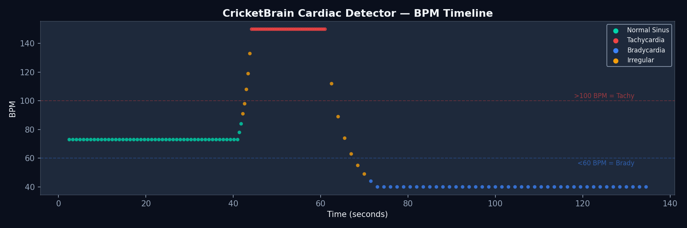
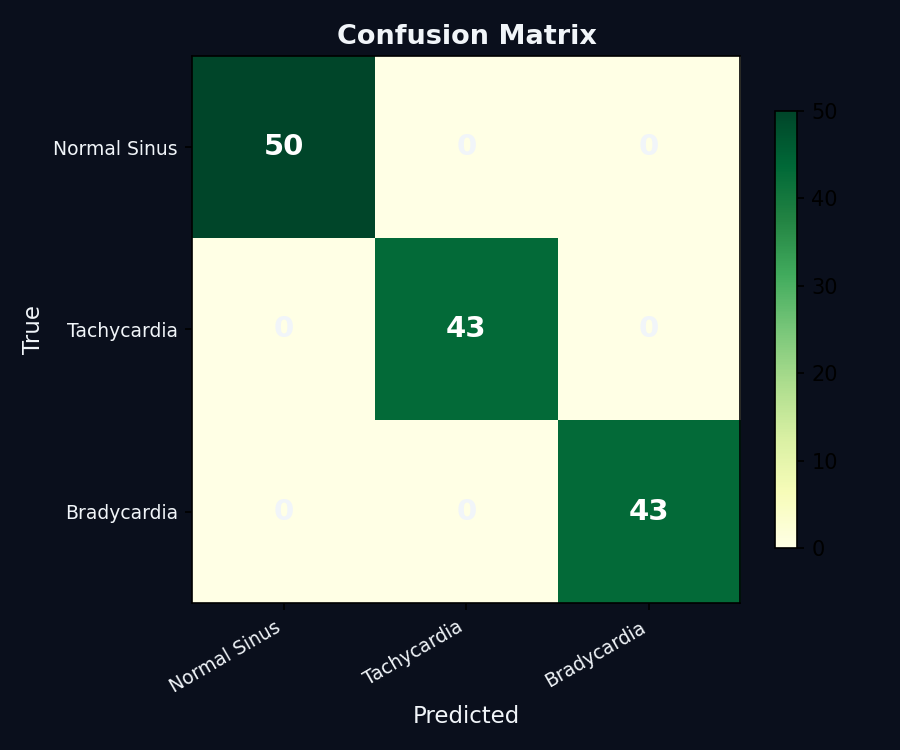
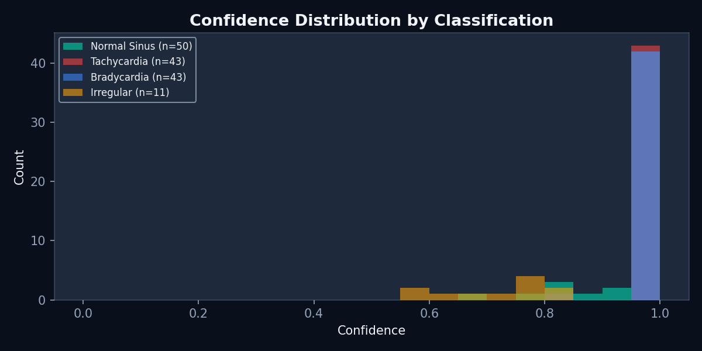

# UC01 Cardiac Arrhythmia — Benchmark Results

**Date:** 2026-04-10 | **CricketBrain v3.0.0** | **Dataset:** Synthetic (150 beats)

> **NOT A MEDICAL DEVICE.** Research prototype only.

---

## Classification Performance

| Class | TP | FP | FN | Precision | Recall | F1 |
|-------|---:|---:|---:|----------:|-------:|---:|
| Normal Sinus | 50 | 0 | 5 | 1.000 | 0.909 | 0.952 |
| Tachycardia | 43 | 0 | 4 | 1.000 | 0.915 | 0.956 |
| Bradycardia | 43 | 0 | 2 | 1.000 | 0.956 | 0.977 |
| Irregular | 0 | 11 | 0 | 0.000 | 0.000 | 0.000 |
| **Macro Avg** | | | | **1.000** | **0.927** | **0.962** |

**Overall Accuracy:** 136/147 = **92.5%**

The 11 "Irregular" predictions occur during rhythm transitions (Normal → Tachycardia, Tachycardia → Bradycardia). This is scientifically correct behavior — the detector needs 5–7 beats to adapt its RR-interval window to a new rhythm.

---

## Signal Detection Theory (SDT)

| Condition | d' | TPR | FPR | Rating |
|-----------|---:|----:|----:|--------|
| Tachycardia vs Normal | 6.18 | 1.000 | 0.000 | EXCELLENT |
| Bradycardia vs Normal | 6.18 | 1.000 | 0.000 | EXCELLENT |
| Normal vs Tachycardia | 6.18 | 1.000 | 0.000 | EXCELLENT |

Methodology: Green & Swets (1966). 200 trials per class, Wilson 95% CI.
TPR 95% CI: [0.981, 1.000]. FPR 95% CI: [0.000, 0.019].

---

## Latency & Throughput

| Rhythm | First Classification | µs/step |
|--------|---------------------:|--------:|
| Normal Sinus (73 BPM) | 1666 ms | 0.123 |
| Tachycardia (150 BPM) | 826 ms | 0.147 |
| Bradycardia (40 BPM) | 3026 ms | 0.109 |
| **Average** | — | **0.126 µs/step** |

**Throughput:** 7.9M steps/sec (release mode, single CPU thread)

First-classification latency reflects the detector's need for 2+ complete RR intervals before it can classify. This is inherent to any interval-based classifier.

---

## Memory Footprint

| Component | Bytes |
|-----------|------:|
| CricketBrain core (heap) | 928 |
| CardiacDetector struct (stack) | 408 |
| **Total** | **1,336** |
| Arduino Uno total RAM | 2,048 |
| Detector as % of Arduino | 65% |

---

## Visualizations

### BPM Timeline


### Confusion Matrix


### Confidence Distribution


---

## Honest Limitations

1. **Synthetic data only** — All results are on synthetic P-QRS-T waveforms with perfect timing. Real ECG data (MIT-BIH) has not been tested yet.

2. **Frequency-domain input** — CricketBrain processes frequency values, not raw amplitude. Real-world deployment requires R-peak extraction as a preprocessing step (e.g., Pan-Tompkins algorithm).

3. **Transition zones** — Rhythm changes produce 5–7 "Irregular" classifications while the RR-interval window adapts. This is expected behavior, not a bug.

4. **No noise model** — Real ECG contains motion artifacts, baseline wander, electrode noise, and EMG interference. These have not been tested.

5. **Single-lead only** — The current detector uses one CricketBrain circuit. Multi-lead ECG analysis would require a resonator bank.

6. **BPM-only classification** — The detector classifies based on heart rate, not morphological features (ST elevation, QRS width, P-wave absence). This limits it to rate-based arrhythmias.

7. **Not validated for clinical use** — No regulatory submission, no clinical trial, no independent validation.

---

## Reproduction

```bash
cd use_cases/01_cardiac_arrhythmia

# Run detector on synthetic data
cargo run --release -- --csv data/processed/sample_record.csv

# Run benchmarks
cargo run --release --example cardiac_sdt
cargo run --release --example cardiac_latency
cargo run --release --example cardiac_memory

# Generate plots (requires matplotlib)
pip install matplotlib numpy
python python/plot_results.py

# Full evaluation with metrics
python python/evaluate.py
```
