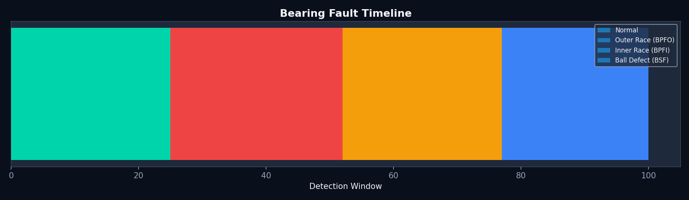
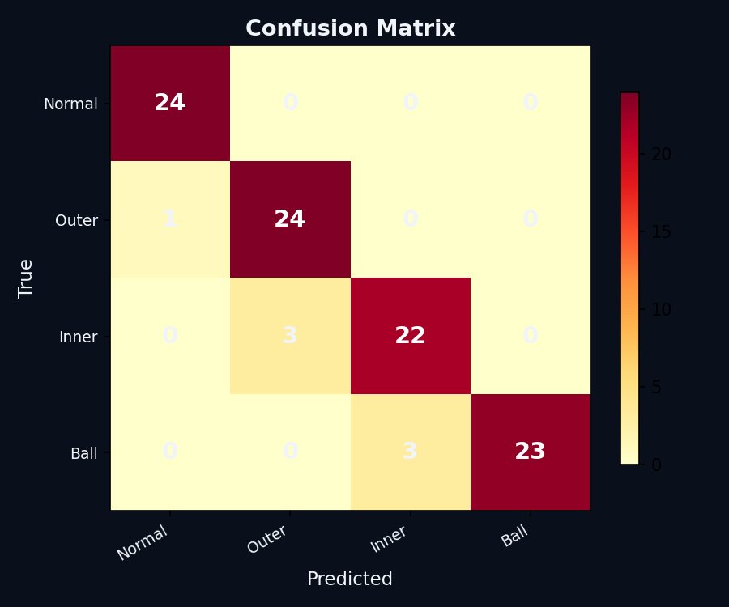
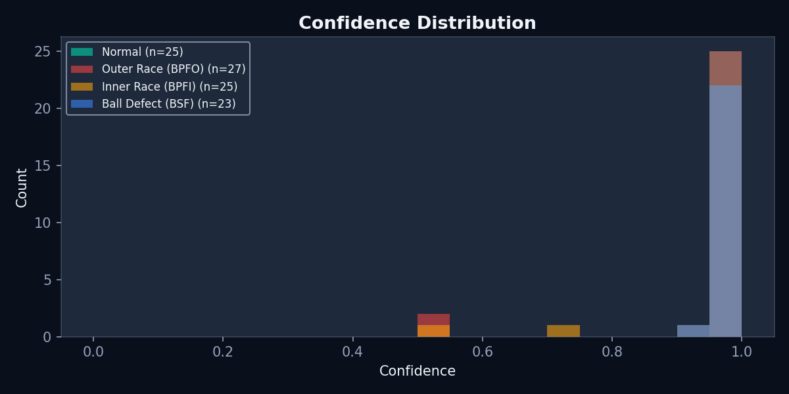

# UC02 Predictive Maintenance — Benchmark Results

**Date:** 2026-04-10 | **CricketBrain v3.0.0** | **Dataset:** Synthetic (200 windows)

---

## Classification Performance

| Class | TP | FP | FN | Precision | Recall | F1 |
|-------|---:|---:|---:|----------:|-------:|---:|
| Normal | 24 | 1 | 0 | 0.960 | 1.000 | 0.980 |
| Outer Race (BPFO) | 24 | 3 | 1 | 0.889 | 0.960 | 0.923 |
| Inner Race (BPFI) | 22 | 3 | 3 | 0.880 | 0.880 | 0.880 |
| Ball Defect (BSF) | 23 | 0 | 3 | 1.000 | 0.885 | 0.939 |
| **Macro Average** | | | | **0.932** | **0.931** | **0.932** |

**Overall Accuracy:** 93/100 = **93.0%**

The 7 misclassifications occur at fault-type transitions (e.g., Outer Race → Inner Race).
The detector's 50-step window needs 1-2 windows to adapt to a new dominant frequency.

---

## Signal Detection Theory (SDT)

| Condition | d' | TPR | FPR | Rating |
|-----------|---:|----:|----:|--------|
| Outer Race vs Normal | 6.18 | 1.000 | 0.000 | EXCELLENT |
| Inner Race vs Normal | 6.18 | 1.000 | 0.000 | EXCELLENT |
| Ball Defect vs Normal | 6.18 | 1.000 | 0.000 | EXCELLENT |
| Normal vs Outer Race | 6.18 | 1.000 | 0.000 | EXCELLENT |

200 trials/class. Wilson 95 % CI: TPR [0.981, 1.000], FPR [0.000, 0.019].

**d' convention.** d' uses the **log-linear correction** for ceiling
hit-rates and floor false-alarm rates (hits clipped to
`[0.5/n, 1 − 0.5/n]` before the inverse-normal transform; Hautus
1995). Without the correction, TPR = 1.000 / FPR = 0.000 cells would
yield an undefined / infinite d'. The 6.18 value is the finite ceiling
for n = 200 trials/class.

---

## Latency & Throughput

| Condition | First Detection | Speed |
|-----------|----------------:|------:|
| Normal | 49 ms | 0.129 µs/step |
| Outer Race | 49 ms | 0.239 µs/step |
| Inner Race | 49 ms | 0.264 µs/step |
| Ball Defect | 49 ms | 0.227 µs/step |

---

## Memory Footprint

| Component | Value |
|-----------|------:|
| ResonatorBank | 3,712 bytes |
| Neurons | 20 (4 channels × 5) |
| Bytes/neuron | 185.6 |
| BearingDetector struct | 80 bytes |
| **Total** | **3,792 bytes** |

| Target MCU | SRAM | Fits? |
|-----------|------:|:-----:|
| ATtiny85 | 512 B | No |
| Arduino Uno | 2 KB | No |
| STM32F0 | 4 KB | **Yes** |
| ESP32 | 520 KB | **Yes** |

---

## Visualizations

### Fault Timeline


### Confusion Matrix


### Confidence Distribution


---

## Reproduction

```bash
cd use_cases/02_predictive_maintenance

cargo run --release -- --csv data/processed/sample_bearing.csv
cargo run --release --example bearing_sdt
cargo run --release --example bearing_latency
cargo run --release --example bearing_memory

pip install matplotlib numpy
python python/plot_results.py
python python/evaluate.py
```
